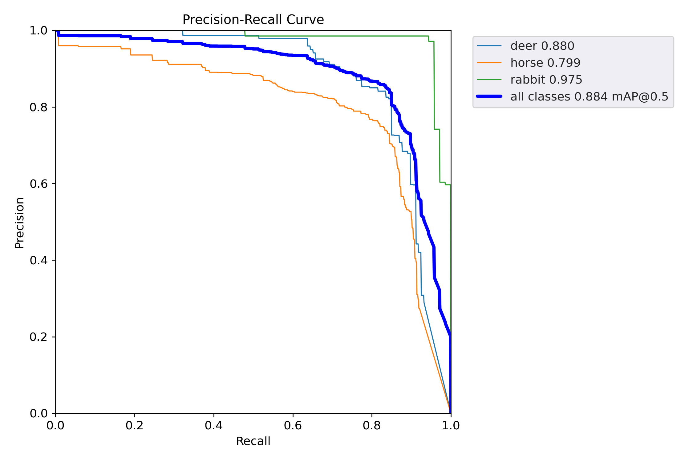
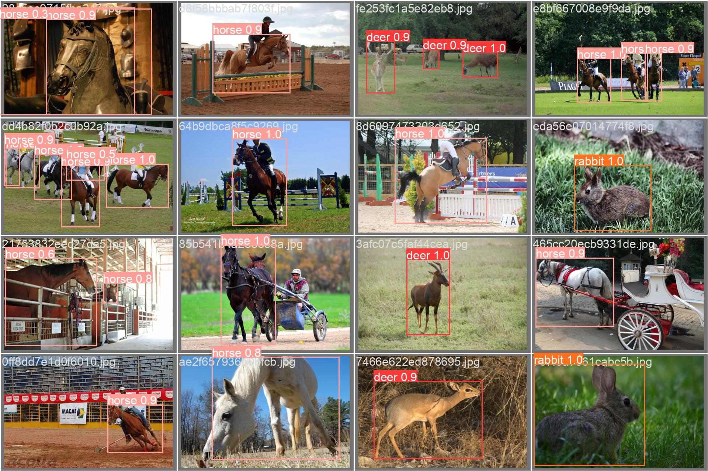

# Wildlife-YOLOv5

This repository applies YOLOv5 on animal images obtained from the Open Images Dataset [Open Images Dataset](https://storage.googleapis.com/openimages/web/index.html). The README provides a step-by-step guide for the entire process, including image gathering, preparation, training the detection algorithm, and evaluation.

## Data Preparation

### Step 1: Download Open Images Dataset CSV Files
You need to download the CSV files for the Open Images Dataset. Check the `starter.ipynb` notebook for the downloading script.

### Step 2: Prepare Data
In the `prepare_data` directory, you'll find two scripts adopted and modified from [original repo](https://github.com/computervisioneng/train-yolov8-custom-dataset-step-by-step-guide) for creating the image list of IDs and transforming them to the YOLO format to prepare for running the detection.

Inside both scripts, specific object IDs are specified (Deer, Horse, Rabbit):
```
# ID for Deer, Horse, Rabbit
object_ids = ['/m/09kx5', '/m/03k3r', '/m/06mf6']
```
You can extend this list for additional or other objects. Check the [class descriptions](https://storage.googleapis.com/openimages/v5/class-descriptions-boxable.csv) for more IDs and corresponding meaningful names.

#### a) Create Image List
Execute the following command to create an image list of the image IDs that belong to the predefined objects:
```
python prepare_data/create_image_list_file.py
```

#### b) Download Raw Images
Execute the following command to download the raw images:
```
python downloader.py image_list_file --download_folder=datasets/raw_images_multi_objects
```

#### c) Collect Annotations
Collect annotations and write an annotation file for each image:
```
python prepare_data/create_dataset_yolo_format.py
```

#### Data Hierarchy
Now the data is in the right format and ready to feed into YOLO for training.

```
datasets/processed_dataset_multi_objects
├── train
│   ├── image.jpg
│   └── image.txt
│       ...
├── test
│   ├── image.jpg
│   └── image.txt
│       ...
└── val
    ├── image.jpg
    └── image.txt
       ...
```
## YOLOv5 Setup

You can alternatively run the `detection.ipynb` notebook. 

### Step 3: Cloning YOLOv5 Repository and Installing Requirements

Clone the YOLOv5 repository from the Ultralytics GitHub repository and install its requirements:

```
git clone https://github.com/ultralytics/yolov5
pip install -r yolov5/requirements.txt
```

### Step 4: Training the Detection YOLOv5

The `detection/`` directory contains configurations for the data. For training, execute the following command:
```
python yolov5/train.py --img-size 640 --batch-size 128 --epochs 140 --data detection/data.yaml --project logs/train
```

You can customize hyperparameters as preferred. The model weights and other artifacts will be stored under `logs/train`.

### Step 5: Model Evaluation

For model evaluation, use the following command:

```
python yolov5/val.py --weights logs/train/exp/weights/best.pt --data detection/data.yaml --project logs/val
```
This will evaluate the best model on the test set and save the results under `logs/val`


## Results





